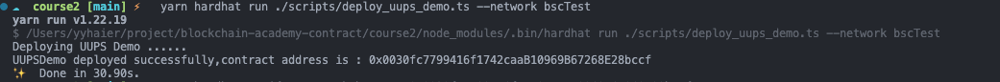
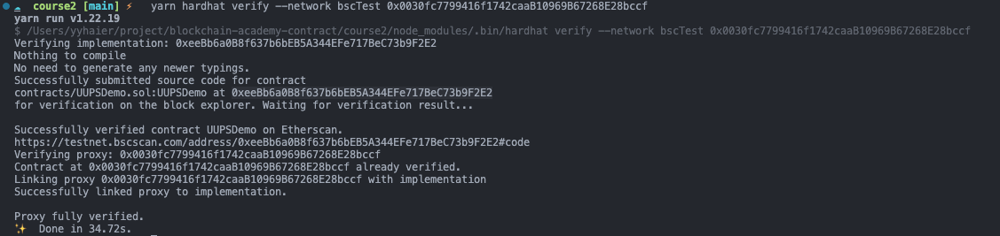
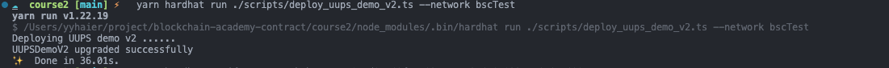
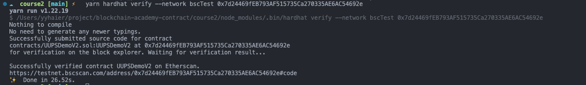

<!--
 * @Author: YYHaier
 * @Github: https://github.com/yuhai-yang
 * @Date: 2023-04-03 10:45:54
 * @LastEditors: yyhaier
 * @LastEditTime: 2023-04-03 16:06:27
 * @FilePath: /blockchain-academy-contract/course2/README.md
-->
# UPGRADE CONTRACT
> UUPS contract

## Deploy Logic And Proxy Contract

## Verify Logic Contract

## Upgrade Logic Contract
> add increaseKey logic

## Verify New Logic Contract
